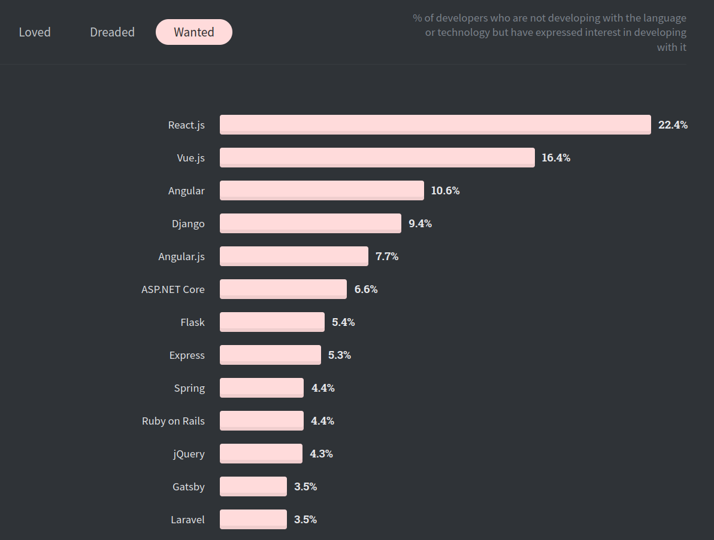
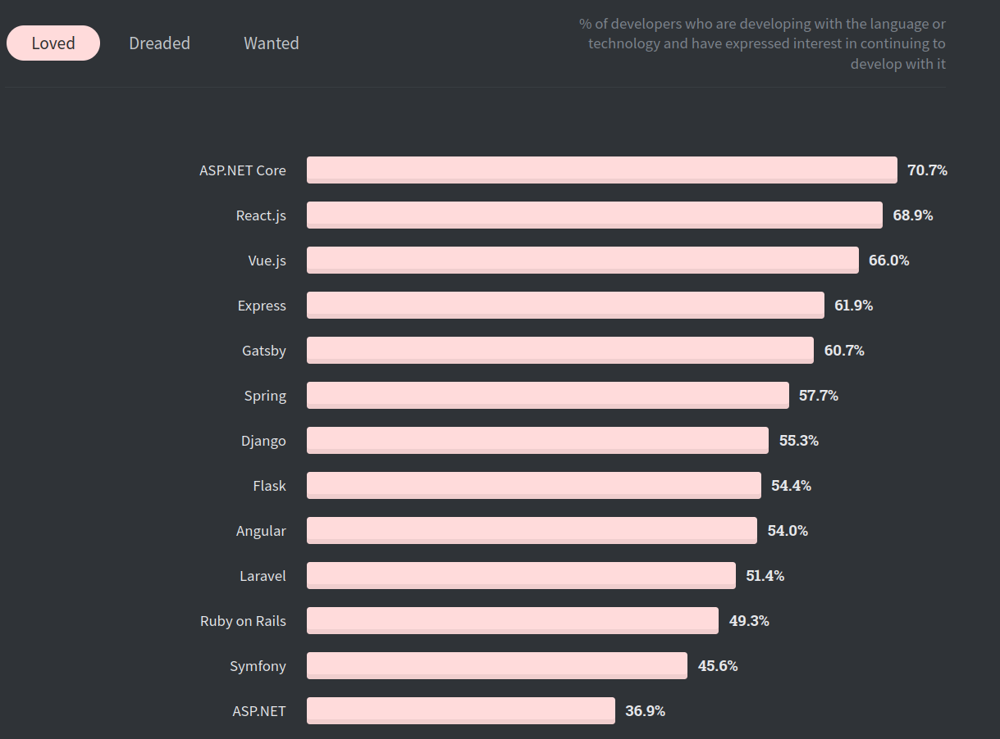

Vue 3 was launched recently in 2020. Having worked with React, Angular, and Ember js, I
always preferred to react for frontend projects as it is pretty straightforward to start with
minimalist features to learn, unlike angular and other libraries.
I see Vue 3 as a library that’s somewhere between react and angular comparing in terms
of templating style, component lifecycle methods, middlewares and directives, and
dependency injection features. We can say that Vue has inherited good characteristics
from its competitor's react and angular with a lot more of its own.
Vue provides a lot of options preserving the simplicity of functional programming and it's
always easy to learn when you have knowledge of any frontend library or framework.

When Vue first started, it was just a runtime library. Over the years, it has evolved into a
the framework that encompasses many sub-projects:


- The core library, i.e. the Vue npm package
- The documentation, with enough content to be considered a book
- The build toolchain, i.e. Vue CLI, Vue-loader, and other supporting packages
- Vue Router for building SPA
- Vuex for state management
- Browser dev tools extension for debugging and profiling
- Vetur, the VSCode extension for Single-File Component IDE support
- ESLint plugin for static style/error checking
- Vue Test Utils for component testing
- Custom JSX transforms that leverage Vue's runtime features
- VuePress for Vue-based static site generation

Not just me, the following statistics show the popularity of Vue 3.


*Figure 1: Stackoverflow survey 2020: Most wanted frontend framework*


*Figure 2: Stackoverflow survey 2020: Most loved frontend framework*

Trends show that Vue has received a lot of love more than any other framework or library
and also it’s usage is growing in recent months.

Vue 3 introduced some pretty cool features unique to it. The major change was the
composition API that allows us to define functions and variables in a single setup wrapper
and use them in our template, unlike the options API where we define methods, watchers,
and computed variables and data distinctly.

Personally, I prefer the composition API rather than the options API, no problem you can
use any of them.

Below I have mentioned some particular pros and cons of Vue 3 over its predecessors and
competitors:

## Advantages 

### 1) Routing


When we talk about frontend libraries we always need to keep in mind the routing libraries
available. Vue router is pretty awesome as it has built-in routing instance methods and
component injections available which enable developers to handle route re-directions and
restrictions in a managed way.

### 2) CLI

With Vue CLI you can choose a set of plugins to use for your project and the CLI will handle
the settings for you.

### 3) Performance
Vue 3 has improved performance up to 55% than in Vue 2. That’s a huge improvement we
can notice in Vue 3 apps. Vue outperforms some of its market competitors like Ember JS, Knockout JS , and Angular JS in performance and memory occupancy.

### 5) Easy Learning Curve
The entry level will be a bit steeper for vue 3 compared to react however if you are familiar
with any libraries/framework like react or angular vue 3 is a piece of cake.

### 6) Built in Typescript support
Vue 3 itself is written in typescript ,so you won’t need any additional tooling to support
typescript. Typescript helps to prevent potential runtime errors through static type
checking.
Also, Typescript may not always be the preferred choice. In such case, vue always have
the option to go with JavaScript to prevent overheads.

### 7) Two Way Binding
Vue offers reactive 2 way data binding functions like in angular. You can use two way
binding in input components with the v-modal directive usage.

### 8) Clear and concise documentation
Vue 3 official documentation is available and it offers a details description from the very
basics to getting started with vue 3 and deployment configurations. The documentation
also suggests best libraries to add with vue 3 that might be important for your project like
routing , validation etc.

### 9) Reactivity
Vue supports reactive variables. Reactivity makes it easy to handle real time updates.With
vue 3 reactivity system, the state can be changed by reassigning values while React uses
hooks to maintain and change component state through methods.

## Downsides
### 1) Maintenance
Whenever the project gets bigger, you have to set up some mechanism to keep up
the coding standard and project structure standardized unlike angular which gives support
built-in modular implementations.

### 2) Supporting libraries
Currently, many libraries in Vue 2 are not yet upgraded to Vue 3. This will
somewhere may hamper your project's scalability. However, libraries for common functions


like State management (Vuex), Routing (Vue-router), Internationalization (Vue-18n),
Validations (Vee-validate), etc are already developed that you can take advantage of.
Overall Vue 3 offers a smaller ecosystem of plugins compared to react or angular.

## Some cool features from Vue 3

### 1) Watchers
One of the hurdles developers face is handling effects whenever some data on the
system changes, the effect may include data fetching, firing some event after a timer
reaches a specific value etc. Vue watchers allow you to watch changes to data and
execute some side effect code.

### 2) Teleport feature
As stated in Vue 3 official docs, sometimes a part of a component's template belongs to
this component logically, while from a technical point of view, it would be preferable to
move this part of the template somewhere else in the DOM, outside of the Vue app. A
a common scenario of the use case may be shifting of video tab on side of the window if we
scroll while watching it on Facebook or Youtube.

Teleport example:

In the example below the actual modal box is mounted to the body element, not on its immediate parent
element.
```
const app = Vue.createApp({});

app.component('modal-telport-button', {
template: `
<button @click="modalOpen = true">
Open full screen modal! (With teleport!)
</button>

<teleport to="body">
<div v-if="modalOpen" class="modal">
<div>
I'm a teleported modal!
(My parent is "body")
<button @click="modalOpen = false">
Close
</button>
</div>
</div>
</teleport>
`,
data() {
return {
modalOpen: false
}
}
})

app.mount('#app')
```
Run Pen


### 3) v-model directives
The v-model directives seems somewhat influenced by angulars ng-model directive.You
can use thev-modeldirective to create two-way databindings on form input, textarea, and
select elements. We can mimic v-model functions on a custom component also.
Modifiers like lazy , number and trim come handy while v-model on input.
```
const app = Vue.createApp({});

app.component('v-model-demo', {
template: `
<input type="text" id="name" v-model="state.name" />
`,
setup() {
const state = reactive({
name:””
})
return {
state
}
}
})

app.mount('#app')
```
### 4) Slots
While in react angular and many other similar tools you can pass single child markup
element wheres slots can be multiple in vue 3 where you can pass multiple markups. This
allows you to seamlessly design layout components.
Slots allow for content distribution.There can be multiple named slots inside a single
component which take certain markup as input.
An example of named slots is given

```
#Slot demo component

<div class="container">
<header>
<slot name="header"></slot>
</header>
<main>
<slot></slot>
</main>
<footer>
<slot name="footer"></slot>
</footer>
</div>

#Usage of slot demo component's


<slot-demo-component>

<template #header>

</template>

<template #default>

<p>main slot content</p>

</template>

<template #footer>

</template>

</slot-demo-component>
```
Here, #header is the shorthand for v-slot=”header”

### 5) Provide/Inject
Provide the data somewhere in the top component hierarchy ie. parent component and
use it anywhere down the hierarchy.

The following example demonstrates reactive value injection using a Compute method to
make data returned by the Provide function reactive since the data returned is not reactive by
default. This ensures changes are reflected in the component using the value.
```
app.component('todo-list', {
// ...
provide() {
return {
todoLength: Vue.computed(() => this.todos.length)
}
}
})

app.component('todo-list-statistics', {
inject: ['todoLength'],
created() {
console.log(`Injected property: ${this.todoLength.value}`) // > Injected property: 5
}
})
```
Keep in mind, while using any framework/libraries the tools you will need to develop your
intended features are supported in the framework. Also if your project is going to be larger
you need to choose between whether you are set to refactor your code constantly and whether you
want more freedom for modifications or you would like to use more of a constrained
 framework like Angular, Ember, etc. to maintain consistency in code.


#### References:
https://cost-of-modules.herokuapp.com/result?p=react@17.0.
https://v3.vuejs.org/guide/introduction.html
https://stefankrause.net/js-frameworks-benchmark8/table.html 
https://insights.stackoverflow.com/survey/2020#technology-most-loved-dreaded-and-wanted-web-frameworks-loved 
https://www.npmtrends.com/@angular/core-vs-backbone-vs-jquery-vs-react-vs-svelte-vs-vue


